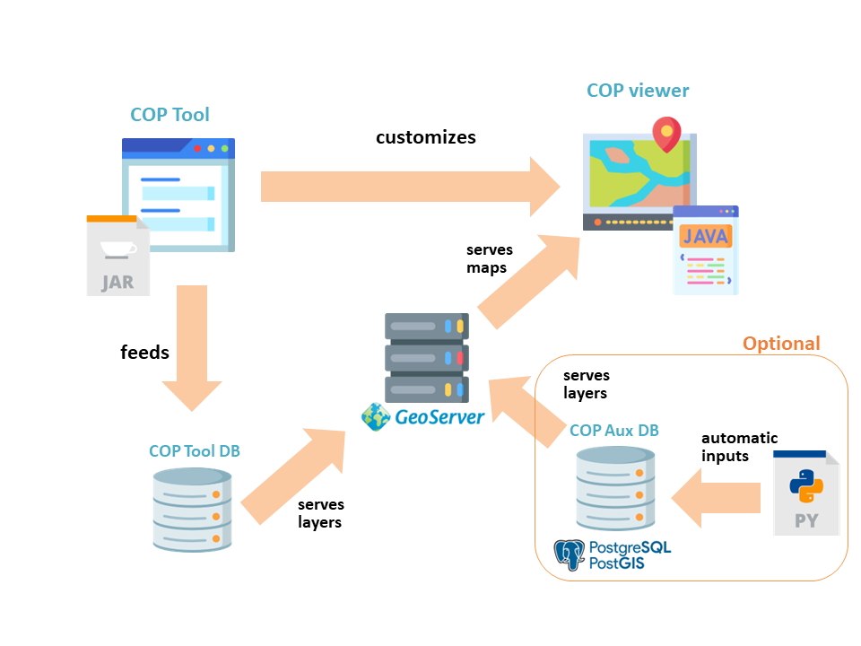

# MANIFESTS-DSS

## BACKGROUND

Taking advantage of the experience gained and the development carried out during the previous HNS-MS and MARINER projects, the MANIFESTS Decision Support System (DSS-MANIFESTS) will integrate several services, including the COPtool (Decision Support System) and a COP Viewer.
This DSS-MANIFESTS means a system designed to exchange information that occurs between the maritime authorities and the different response teams (sea, coast, air), during a marine pollution contingency, in order to carry it out in the most efficient way possible, guaranteeing that all actors involved in the crisis committee and response teams can access the same data.

## GENERAL SCHEMA

The implementation of DSS-MANIFESTS is divided into three components:

* **COPtool:** Software consisting of a graphical interface and an associated database for user management, and its modules. 

* **COP Viewer:** Software for exploring the maps of a contingency managed by the COPtool.

* **Auxiliary COP:** Database with other relevant information such as model results, derivators, etc. and associated insertion scripts.

Every components is related with the others as shown in the next picture:

Each of three components has its own repository in this site. Also a **DOCUMENTS**  repository (this one) is included.

## DOCUMENTS

This repository contains all the general documents to know and use the Decision Support System for deal with accidental maritime spills developed under the Project MANIFESTS.

* **DSS general explanation:** A document with a general view of the tool, the problem to deal with, the conceptual solution, and the implementation of the tool.
* **User Guide:**  A complete guide of how to use the software.  

## Note

For installation guides, please, go to the specific software repositories.
